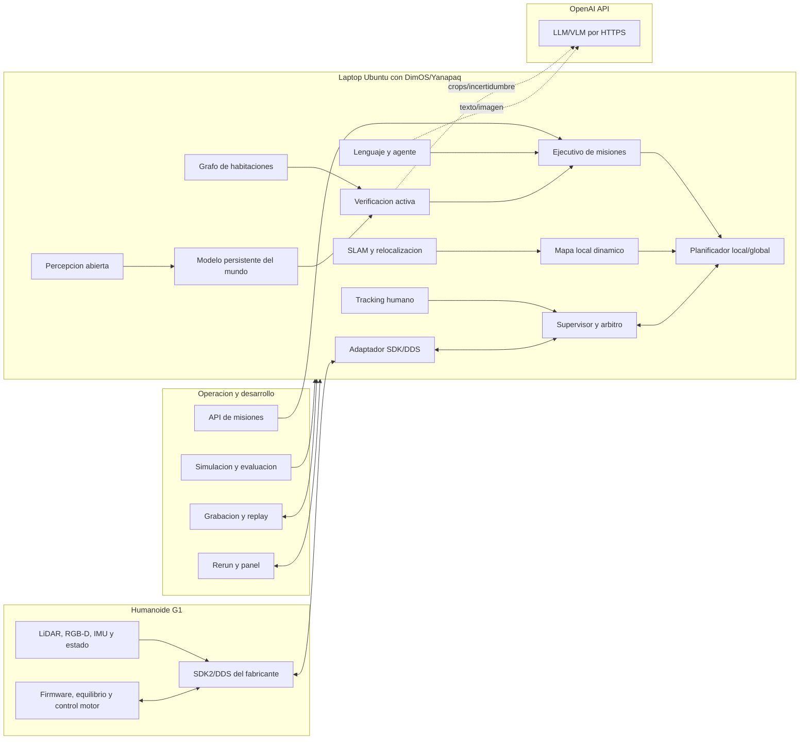

# Especificacion tecnica de software y despliegue de Yanapaq

Ultima modificacion: 2026-06-12 16:23:07 -05 -0500

Estado: propuesta de arquitectura e implementacion. Este documento no implica
que los componentes nuevos ya esten implementados ni validados en el robot
real.

## 1. Objetivo del informe

Este informe describe como se construira el software de Yanapaq: componentes,
procesos, herramientas, APIs, comunicaciones, persistencia, requisitos de
computo, pruebas, despliegue y tratamiento de fallos.

El despliegue objetivo inicial sera simple: un humanoide, comenzando por el
Unitree G1 EDU, conectado por Ethernet a una laptop Ubuntu potente. En el robot
permanecen firmware, equilibrio, control motor, sensores y comunicacion del
fabricante. En la laptop corre Yanapaq sobre DimOS: SLAM, navegacion,
supervision, percepcion, memoria, ejecutivo de misiones, visualizacion y cliente
OpenAI API para LLM/VLM.

La arquitectura se separara en un nucleo independiente del fabricante y
adaptadores especificos para cada humanoide. El objetivo es que agregar otro
robot no obligue a reescribir la memoria, el ejecutivo de misiones, la busqueda
semantica ni las herramientas de evaluacion.

Se usara DimOS como runtime modular y como fuente de componentes existentes,
pero se modificaran las partes que actualmente no cumplen los requisitos de
persistencia, seguridad, integracion o portabilidad de Yanapaq.

## 2. Decision arquitectonica principal

Yanapaq no sera una sola aplicacion monolitica ni un modelo neuronal que
controle directamente al humanoide. Se implementara como un sistema de
modulos con dos dominios:

1. **Dominio critico local en la laptop:** localizacion, obstaculos,
   planificacion local, arbitraje, watchdog, limites y adaptador del robot.
2. **Dominio cognitivo:** lenguaje, memoria persistente, habitaciones,
   deteccion abierta, verificacion activa y planificacion de mision. Este
   dominio puede llamar a OpenAI API, pero no controla directamente el robot.

El dominio critico debe poder detener el robot aunque:

- se caiga el proceso del agente;
- falle el VLM o la API remota;
- se pierda la conexion con la laptop;
- la base de datos este bloqueada;
- la memoria semantica produzca una ubicacion incorrecta;
- llegue una segunda fuente de movimiento;
- un comando quede retrasado en la red.

El dominio cognitivo puede reiniciarse y recuperar su estado. Ningun resultado
del LLM o VLM se convierte directamente en una orden articular o de velocidad.



## 3. Alcance inicial

### Incluido

- navegacion interior por pose, habitacion, lugar u objeto;
- memoria persistente entre sesiones;
- objetos estaticos, semiestaticos, movibles y personas;
- actualizacion de objetos movidos, agregados o retirados;
- clasificacion de habitaciones y relaciones;
- exploracion y busqueda dirigida;
- instrucciones por texto y voz;
- control de movimiento de alto nivel;
- parada, cancelacion y recuperacion;
- simulacion, replay y registro reproducible;
- adaptacion posterior a otros humanoides.

### Excluido del primer sistema

- control motor o equilibrio desarrollado desde cero;
- manipulacion diestra;
- subir escaleras;
- locomocion en terreno extremo;
- reconocimiento facial;
- identificacion persistente de personas;
- operacion publica sin supervisor;
- certificacion funcional de seguridad;
- entrenamiento de una politica de locomocion propia.

## 4. Punto de partida disponible

### Componentes que se reutilizaran

| Componente existente | Uso en Yanapaq |
|---|---|
| `Module`, `Blueprint` y `autoconnect()` | Composicion y ciclo de vida |
| Workers con `forkserver` | Aislamiento de procesos y CUDA |
| Streams tipados y `Spec` | Contratos internos |
| LCM y memoria compartida | Comunicacion local |
| CycloneDDS y Unitree SDK2 | Frontera con el G1 |
| FAST-LIO2 nativo | Odometria LiDAR-inercial |
| PGO y cierre de lazo | Correccion global |
| Ray tracing voxelado | Eliminacion de obstaculos transitorios |
| Terrain analysis y costmaps | Navegabilidad |
| A* y planificadores locales | Rutas y replanning |
| YOLOE y registro 3D | Deteccion abierta inicial |
| Rerun | Visualizacion |
| Memory2/SQLite y replay | Registro de streams |
| MCP y capacidades | Herramientas agenticas con exclusion mutua |
| MuJoCo | Simulacion del humanoide |

### Problemas que deben corregirse

1. Los blueprints de navegacion, percepcion y agente G1 no forman todavia un
   unico flujo completo.
2. Existe una habilidad de movimiento directo expuesta al agente. Yanapaq no
   debe permitir que el LLM publique velocidad libre.
3. La habilidad de navegacion inicia un objetivo pero no mantiene siempre la
   capacidad de movimiento hasta que el robot termina.
4. La base de objetos actual promueve entidades permanentes, pero no implementa
   un ciclo de vida completo para movimiento, ausencia y retiro.
5. La memoria temporal es experimental y no representa habitaciones,
   visibilidad, versiones de pose ni evidencia negativa.
6. El tracker de personas G1 actual no es suficiente: elige una deteccion y
   puede asumir profundidad fija.
7. No existe un clasificador y grafo de habitaciones integrado.
8. No existe un ejecutivo persistente de misiones con reanudacion.
9. El servidor MCP permite CORS amplio y no debe publicarse sin autenticacion.
10. El replay completo del G1 real y la inyeccion sistematica de fallos aun
    deben construirse.
11. La instalacion GPU en Jetson no es actualmente una ruta completamente
    reproducible: los wheels aarch64 dependen de la version de JetPack.
12. Hay parametros de sensor y marcos especificos del G1 que deben salir del
    codigo y pasar a manifiestos y calibraciones versionadas.

Estas brechas no requieren reemplazar todo DimOS. Requieren encapsular lo
existente y agregar contratos mas estrictos en los limites correctos.

## 5. Topologia fisica recomendada

Yanapaq se construira y validara primero con dos elementos:

```text
Humanoide G1
    - firmware, equilibrio y control motor
    - sensores y estado
    - SDK2/DDS del fabricante
        |
        | Ethernet cableado, baja latencia
        v
Laptop Ubuntu
    - DimOS/Yanapaq
    - SLAM, mapa, navegacion y supervisor
    - percepcion y memoria semantica
    - ejecutivo de misiones
    - cliente OpenAI API para LLM/VLM
    - Rerun, logs, replay y herramientas
        |
        | HTTPS/TLS, solo cognicion
        v
OpenAI API
    - interpretacion de lenguaje
    - verificacion visual cuando exista incertidumbre
```

Esta es la topologia principal del proyecto. No se requiere una workstation
extra ni un servidor local de modelos. La laptop debe tener GPU suficiente para
percepcion local, visualizacion y replay, pero las capacidades LLM/VLM se
consumiran por API.

### 5.1 Perfil principal: G1 + laptop

Todo el software de alto nivel corre en una laptop Ubuntu conectada por
Ethernet al G1. El robot conserva su firmware, equilibrio y servicios del
fabricante.

Ventajas:

- instalacion y depuracion mas simples;
- GPU x86 compatible con PyTorch y modelos existentes;
- acceso directo a logs y visualizacion;
- no requiere preparar Jetson desde el primer dia.
- el costo y complejidad de integracion son menores;
- coincide con el enfoque practico de DimOS para desarrollo.

Limitaciones:

- depende del enlace laptop-robot;
- cables y adaptadores pueden dificultar movimiento;
- la laptop debe estar cerca del robot;
- el consumo de OpenAI API debe controlarse con timeouts, cache y politicas.

Este sera el perfil para integrar, evaluar y demostrar la mision completa.

### 5.2 Variante futura: computador companero

Despues de validar el sistema, se puede mover una parte del dominio critico a
un computador companero montado en el humanoide. Esto no cambia el diseno
conceptual, solo reduce dependencia del cable y mejora autonomia.

```text
G1 firmware/control
    |
    | DDS por Ethernet dedicado
    v
Computador companero
    - adaptador de robot
    - supervisor y watchdog
    - sensores
    - SLAM
    - mapa local
    - tracking de personas
    - planificacion
    - cache de mision
    |
    | red de servicios no critica
    v
Laptop
    - agente
    - memoria persistente
    - deteccion abierta
    - cliente OpenAI API
    - UI
    - almacenamiento y evaluacion
```

Si se pierde la laptop, el computador companero detiene o completa de forma
controlada la habilidad vigente. Nunca mantiene movimiento indefinido.

Esta variante no es necesaria para el MVP.

### 5.3 Variante futura: completamente a bordo

Todo corre en un modulo GPU montado en el humanoide. Es el perfil con mayor
autonomia, pero exige mas potencia, refrigeracion, almacenamiento y trabajo de
compatibilidad aarch64.

Un Orin NX de 16 GB puede ejecutar SLAM, deteccion y planificacion optimizadas,
pero no es prudente asumir que tambien ejecutara visualizacion completa y
percepcion densa sin degradar latencia. Para autonomia totalmente a bordo se
preferira:

- AGX Orin de 32/64 GB, o un modulo equivalente;
- modelos cuantizados;
- TensorRT/ONNX para detectores;
- cliente OpenAI API activado por eventos si hay conectividad;
- visualizacion remota y grabacion limitada.

## 6. Que corre en cada equipo

| Proceso | Humanoide G1 | Laptop Yanapaq | OpenAI API |
|---|---:|---:|---:|
| Equilibrio y servos | Si | No | No |
| FSM y locomocion del fabricante | Si | Cliente seguro | No |
| Adaptador SDK2/DDS | No | Si, obligatorio | No |
| Watchdog y parada | Firmware + cliente | Si, obligatorio | No |
| SLAM y odometria | Sensores/estado | Si | No |
| Mapa local y costmap | No | Si | No |
| Planificador de trayectoria | No | Si | No |
| Tracking de personas | No | Si | No |
| Deteccion abierta de objetos | No | Si, local | No |
| Verificacion visual dificil | No | Prepara crop/contexto | Si, por API |
| Modelo persistente del mundo | No | Si | No |
| Ejecutivo de mision | No | Si | No |
| Lenguaje y razonamiento | No | Cliente y politicas | Si, por API |
| ASR/TTS | Opcional nativo | Si, si aplica | Opcional si se usa API |
| Rerun y dashboard | No | Si | No |
| Grabacion completa | No | Si | No |

El sistema no dependera de que el computador basico incluido en toda variante
del G1 tenga GPU. Unitree publica un CPU basico de ocho nucleos y ofrece
modulos de alto computo como opcion; el inventario real del robot debe
confirmarse antes de congelar el despliegue.

## 7. Hardware necesario

### 7.1 Robot

- Unitree G1 EDU con acceso SDK y SSH;
- firmware y modo de locomocion compatibles con SDK2;
- control remoto oficial y parada accesible;
- 3D LiDAR;
- camara RGB-D;
- IMU y estado del robot;
- montaje rigido y calibrable de sensores;
- red Ethernet disponible;
- estructura de soporte o gantry durante bring-up.

El G1 comercial indica camara de profundidad y LiDAR 3D, pero el modelo,
firmware y acceso a streams pueden variar. No se asumira que el sensor
integrado coincide automaticamente con el driver disponible.

### 7.2 Sensores recomendados para el prototipo

**LiDAR:** Livox Mid-360.

- 360 grados horizontales;
- 59 grados verticales;
- 200 000 puntos por segundo;
- 10 Hz tipicos;
- Ethernet 100 BASE-TX;
- IMU integrada;
- rango tipico de 40 m con baja reflectividad.

**Camara:** RealSense D455/D455f o ZED equivalente.

- RGB y profundidad sincronizables;
- obturador global;
- profundidad util aproximada de 0.6 a 6 m en D455;
- USB 3;
- intrinsecos accesibles por SDK;
- soporte de profundidad alineada a color.

D455f puede ser util con reflejos e iluminacion compleja, pero debe validarse
en el entorno real. ZED es viable si el SDK, la GPU y la calibracion estan
disponibles. La arquitectura no dependera de una marca: ambas implementaran el
mismo contrato `DepthCameraSpec`.

### 7.3 Laptop minima para desarrollo

| Recurso | Minimo funcional | Recomendado |
|---|---|---|
| Sistema | Ubuntu 22.04/24.04 | Ubuntu 24.04 |
| CPU | 8 nucleos | 12-16 nucleos |
| RAM | 32 GB | 64 GB |
| GPU | RTX con 8 GB VRAM | RTX 4070 o superior, 12-16 GB |
| Disco | 100 GB SSD libres | 1 TB NVMe |
| Red | 1 Ethernet + USB Ethernet | 2 Ethernet + Wi-Fi |
| USB | USB 3 para RGB-D | Controlador dedicado USB 3 |

Con 8 GB de VRAM se ejecutaran detectores, embeddings y simulacion moderada.
Para el proyecto base, LLM/VLM no correran localmente: se llamaran mediante
OpenAI API. Una GPU mayor ayuda a replay, visualizacion, simulacion y modelos
de percepcion locales, pero no es requisito para hospedar un VLM.

### 7.4 Computador companero opcional

No es requisito para el MVP. Solo se considerara cuando el sistema G1+laptop
este validado y se quiera reducir dependencia del cable o mover parte del
dominio critico al robot.

Opciones futuras:

- Orin NX 16 GB para control, SLAM y percepcion optimizada;
- AGX Orin 32/64 GB para mas inferencia local geometrica;
- mini-PC x86 con GPU NVIDIA si peso y consumo lo permiten.

Requisitos adicionales:

- NVMe de al menos 256 GB, preferible 1 TB;
- refrigeracion activa;
- fuente DC regulada y fusible;
- doble interfaz Ethernet o switch interno;
- USB 3 estable;
- montaje que no altere el centro de masa de forma peligrosa;
- monitoreo de temperatura, potencia y espacio libre.

### 7.5 Accesorios

- switch Ethernet pequeno o adaptadores USB-Ethernet;
- cables con alivio de tension;
- fuente separada para sensores cuando corresponda;
- marcador de calibracion o tablero AprilTag;
- cinta de seguridad y limites fisicos del area;
- boton de parada o mecanismo equivalente del laboratorio;
- punto de acceso aislado para desarrollo;
- almacenamiento externo para datasets.

## 8. Red y comunicaciones fisicas

### 8.1 Redes separadas

Se recomiendan interfaces logicas separadas, aunque fisicamente pueden vivir en
la misma laptop:

1. **Red de control G1:** SDK2/DDS, Ethernet cableado.
2. **Red de sensores:** LiDAR y, si corresponde, camaras Ethernet.
3. **Red de operacion/internet:** SSH, Rerun, actualizaciones y OpenAI API.

No se usara Wi-Fi como unico enlace para el lazo de parada o comandos
continuos. Wi-Fi y Tailscale son aceptables para administracion y
visualizacion, no como garantia de seguridad ni control.

Ejemplo de inventario:

```text
nic_robot: 192.168.123.x/24
nic_lidar: 192.168.1.x/24 o configuracion real del G1
nic_management: DHCP/Wi-Fi
```

Los valores actuales del laboratorio pueden usar otras direcciones. Se
guardaran en configuracion, nunca dispersos en el codigo.

### 8.2 DDS

Unitree SDK2 usa CycloneDDS. El adaptador debe:

- fijar explicitamente la NIC del robot;
- verificar que el robot aparece antes de habilitar movimiento;
- usar un dominio DDS reservado;
- fallar si detecta una interfaz ambigua;
- mantener un unico propietario de los comandos;
- cerrar publishers y subscribers explicitamente;
- registrar modo FSM, errores y latencia.

CycloneDDS puede seleccionar interfaces automaticamente, pero en hosts con
Ethernet, Wi-Fi, Docker y Tailscale esto produce fallos de discovery. Se usara
un archivo XML y `CYCLONEDDS_URI` para fijar interfaz, multicast, peers y
tracing.

### 8.3 Comunicacion interna

| Datos | Transporte preferido | Razon |
|---|---|---|
| Imagen RGB/depth en la misma maquina | SHM/pSHM | Evitar copias y UDP grande |
| Point cloud local | SHM o transporte nativo | Alto ancho de banda |
| Odometria, estados y metas locales | LCM | Baja latencia y tipos existentes |
| Control Unitree | DDS/SDK2 | Interfaz oficial |
| API OpenAI | HTTPS/TLS | Solo lenguaje y verificacion visual |
| Herramientas agenticas | MCP sobre HTTP local | Descubrimiento de skills |
| Eventos de UI | SSE/WebSocket | Observacion, no control |
| Grabacion | SQLite/MCAP | Replay reproducible |

El coordinador actual administra workers locales. La primera version ejecutara
los modulos de Yanapaq en la laptop. Si en el futuro se agrega un computador
companero, cada host ejecutara su blueprint y se conectara mediante un gateway
de streams explicito.

### 8.4 Frecuencias y politicas

| Canal | Frecuencia objetivo | Politica |
|---|---:|---|
| Estado locomotor | 50-500 Hz segun SDK | Ultima muestra, baja latencia |
| `cmd_vel` autorizado | 20-50 Hz | Caduca en <= 200 ms |
| Odometria | 30 Hz | Orden temporal estricta |
| Point cloud registrado | 10 Hz | Puede perder frames |
| Mapa local | 5-10 Hz | Ultimo estado |
| Plan local | 5-10 Hz | Reemplazable |
| Personas | 10-20 Hz | Ultimo track y covarianza |
| Objetos generales | 1-5 Hz o evento | Backpressure, ultimo frame |
| Habitaciones/VLM | Por evento | Timeout y cancelacion |
| Estado de mision | 2-10 Hz + eventos | Reliable/persistente |

No se enviaran imagenes sin comprimir entre maquinas. Se usara JPEG/H.264 para
visualizacion y keyframes seleccionados para semantica.

## 9. Sincronizacion temporal y marcos

### Tiempo

Cada mensaje distinguira:

- `wall_time_utc`: auditoria;
- `monotonic_time`: deadlines y timeouts;
- `sensor_time`: fusion y alineacion.

En una sola maquina se usara el reloj monotono local. En varias maquinas:

- PTP cuando el hardware lo permita;
- Chrony/NTP como minimo;
- medicion periodica de offset;
- rechazo de fusion si el desfase supera el limite configurado.

### Marcos

Convencion:

```text
map -> odom -> base_link
base_link -> lidar_link
base_link -> camera_link
camera_link -> camera_color_optical_frame
camera_link -> camera_depth_optical_frame
```

- `map` admite correcciones globales;
- `odom` es local y continuo;
- las entidades persistentes se almacenan en `map`;
- el control local usa `odom` o `base_link`;
- nunca se mezclan poses sin declarar el frame.

### Calibraciones obligatorias

- intrinsecos RGB y depth;
- extrinseco RGB-depth;
- LiDAR-IMU;
- LiDAR-base;
- camara-base;
- altura y huella efectiva del robot;
- latencia de sensores;
- direccion y signo de velocidades;
- distancia real de frenado.

Cada calibracion tendra:

```text
calibration_id
robot_id
sensor_serial
timestamp
method
transform
covariance
operator
checksum
```

Si cambia el montaje, la calibracion anterior queda invalida.

## 10. Stack de software

### Sistema y toolchain

- Ubuntu 24.04 x86_64 para desarrollo principal;
- Python 3.12 en x86;
- `uv` para entorno y lockfile;
- Nix para binarios nativos reproducibles;
- CMake para FAST-LIO2/Livox;
- Rust para mapa ray-tracing y componentes de alto rendimiento;
- Git LFS para datasets;
- Docker solo para herramientas auxiliares, nunca como dependencia del lazo de
  control.

Si en una fase futura se usa Jetson, no se mezclara una instalacion CUDA
generica con JetPack. En ese caso se usaran PyTorch, TensorRT y ONNX Runtime
compatibles con la version exacta de JetPack.

### Bibliotecas principales

| Funcion | Tecnologia |
|---|---|
| Runtime modular | DimOS |
| Validacion de contratos | Pydantic v2 |
| Flujos reactivos | ReactiveX |
| Robot G1 | Unitree SDK2 Python |
| Middleware robot | CycloneDDS |
| LiDAR | Livox SDK2 |
| SLAM | FAST-LIO2 |
| Optimizacion de poses | GTSAM/iSAM2 |
| Geometria 3D | Open3D y NumPy |
| Vision | OpenCV |
| Detectores | Ultralytics/YOLOE |
| Inferencia optimizada | ONNX Runtime/TensorRT |
| Embeddings | CLIP/MobileCLIP o SigLIP validado |
| VLM/LLM | OpenAI API |
| Persistencia | SQLite WAL + sqlite-vec |
| API | FastAPI |
| Agente/herramientas | MCP |
| Visualizacion | Rerun |
| Grabacion | Memory2 SQLite y MCAP |
| Simulacion | MuJoCo |
| Pruebas | Pytest, replay e inyeccion de fallos |

### Tecnologias externas que se evaluaran

- Khronos para ideas de mapa espacio-temporal;
- Hydra para jerarquia lugar-habitacion-objeto;
- DynaMem/DovSG para actualizacion de memoria;
- HuNavSim 2.0 para personas simuladas;
- Habitat/HM3D para benchmarks semanticos.

No se integraran repositorios completos sin una prueba de valor. Se copiaran
contratos o algoritmos concretos cuando superen al componente existente bajo
el mismo replay. El stack principal no dependera de ROS2.

## 11. APIs necesarias

### 11.1 Obligatorias

1. **Unitree SDK2/CycloneDDS**
   - estado;
   - cambio de modo;
   - `Move`, `SetVelocity`, `StopMove`;
   - FSM;
   - errores del robot.
2. **Livox SDK2**
   - point cloud;
   - IMU;
   - configuracion de red;
   - timestamps.
3. **SDK de la camara**
   - RGB;
   - profundidad;
   - intrinsecos;
   - escala de depth;
   - serial y estado.
4. **API interna de misiones**
   - crear;
   - consultar;
   - cancelar;
   - reanudar;
   - observar eventos.
5. **OpenAI API**
   - interpretacion de instrucciones;
   - plan de alto nivel estructurado;
   - verificacion VLM sobre crops o keyframes;
   - resumen de eventos para el operador;
   - limites de costo, timeout y privacidad.

### 11.2 Opcionales

- servicio VUI/ASR del G1 o API externa de voz;
- TTS o altavoz del robot;
- PostgreSQL/PostGIS para flota;
- almacenamiento S3 para datasets;
- ASR/TTS por API externa si se decide usar voz completa.

No se requiere una API cloud para detener, localizar, evitar personas o
seguir una ruta. OpenAI API se usara solo en el dominio cognitivo:

- `OPENAI_API_KEY` se almacena como secreto;
- se fija el modelo y fecha de evaluacion;
- se registran prompt y respuesta;
- se limita costo y timeout;
- imagenes con personas se filtran segun politica de privacidad;
- si la API falla, el robot se detiene o ejecuta una busqueda geometrica
  explicable, pero no improvisa control.

## 12. API externa de Yanapaq

Se expondra una API de mision, no una API abierta de velocidad.

### Operaciones

```text
POST   /v1/missions
GET    /v1/missions/{mission_id}
POST   /v1/missions/{mission_id}/cancel
POST   /v1/missions/{mission_id}/resume
GET    /v1/missions/{mission_id}/events
GET    /v1/world/entities
GET    /v1/world/rooms
POST   /v1/world/query
GET    /v1/health
GET    /v1/config/effective
```

### Ejemplo conceptual de mision

```text
mission_type: VERIFY_OBJECT
target:
  description: lonchera azul
  expected_room: cocina
constraints:
  max_duration_s: 300
  max_speed_mps: 0.4
  allow_exploration: true
postcondition:
  visual_confirmation_required: true
```

La API valida esquema, autentica al operador y asigna `mission_id`,
`trace_id`, prioridad e idempotency key.

### MCP

MCP sera una interfaz para agentes y herramientas externas. Solo expondra
operaciones de alto nivel:

- `start_mission`;
- `cancel_mission`;
- `query_world`;
- `verify_object`;
- `navigate_to_room`;
- `speak`;
- `get_mission_status`.

No expondra `move(vx, vy, yaw)` al LLM en el modo autonomo. El control manual
directo existira en una herramienta de mantenimiento separada, autenticada y
mutuamente exclusiva.

## 13. Contratos internos

Contratos minimos:

```text
MissionSpec
MissionStatus
MissionEvent
NavigationGoal
NavigationStatus
MotionRequest
SafeMotionCommand
RobotState
LocalizationStatus
TrackedPerson
ObservedObject
WorldEntity
RoomNode
Evidence
VerificationRequest
VerificationResult
ComponentHealth
SafetyEvent
EpisodeManifest
```

Reglas:

- unidades SI;
- frame obligatorio para poses;
- timestamps y version de esquema;
- `valid_until` en todo comando fisico;
- identificadores UUID;
- `extra="forbid"`;
- enums, no cadenas libres, para estados;
- covarianza o confianza cuando exista incertidumbre;
- idempotencia en efectos;
- errores recuperables y terminales separados;
- procedencia de toda afirmacion semantica.

## 14. Abstraccion para cualquier humanoide

La logica comun dependera de interfaces, no de clases Unitree.

### Interfaces de plataforma

```text
HumanoidStateSpec
HumanoidLocomotionSpec
HumanoidSafetySpec
HumanoidAudioSpec
HumanoidWholeBodySpec
DepthCameraSpec
LidarSpec
```

`HumanoidLocomotionSpec` definira:

- aceptar velocidad o waypoints;
- detener;
- consultar estado;
- cambiar modo autorizado;
- informar limites;
- confirmar reposo.

`HumanoidSafetySpec` definira:

- ESTOP/protective stop;
- fallos;
- inclinacion;
- contacto;
- bateria;
- temperatura;
- autoridad de movimiento.

### Manifiesto de robot

Cada robot tendra un manifiesto:

```text
robot_model
adapter
firmware_range
control_mode
footprint
height_clearance
max_velocity
max_acceleration
stop_semantics
state_topics
sensor_inventory
frames
calibration_bundle
capabilities
```

Para agregar otro humanoide se implementan adaptadores y se ejecuta la suite
de conformidad. La memoria y las misiones no se modifican.

### Dos niveles de locomocion

1. **Alto nivel, inicial:** el fabricante mantiene equilibrio y el sistema
   envia velocidad o metas.
2. **Whole-body, futuro:** una politica o controlador propio publica
   referencias articulares.

Yanapaq comenzara con alto nivel. El control whole-body requiere otra
certificacion experimental y no se mezclara con el primer paper.

## 15. Blueprint integrado

Se creara un blueprint unico, conceptualmente:

```text
yanapaq_g1_real
  sensors
  localization
  geometry
  dynamic_perception
  semantic_world
  mission_execution
  safety
  robot_adapter
  observability
  api
```

Variantes:

```text
yanapaq_g1_sim
yanapaq_g1_replay
yanapaq_g1_shadow
yanapaq_generic_humanoid_fake
```

El modo `shadow` procesa sensores y genera decisiones, pero bloquea toda
salida fisica. Es obligatorio antes de activar una version nueva en el G1.

## 16. Modulos de software

| Modulo | Entrada | Salida | Critico | Ubicacion |
|---|---|---|---:|---|
| `RobotAdapter` | Comando seguro | Estado/accion | Si | Junto al robot |
| `MotionAuthority` | Solicitudes | Lease de movimiento | Si | Junto al robot |
| `SafetySupervisor` | Estado, personas, comandos | Comando seguro | Si | Junto al robot |
| `SensorHealth` | Telemetria | Salud | Si | Junto al robot |
| `FastLio2Adapter` | LiDAR/IMU | Odometria/mapa | Si | Junto al robot |
| `PoseGraphManager` | Odometria/loops | `map->odom` | Si | Junto al robot |
| `LocalVoxelMap` | Scan/pose | Ocupacion local | Si | Junto al robot |
| `NavigationPlanner` | Goal/mapa | Path/velocidad solicitada | Si | Junto al robot |
| `PersonTracker3D` | RGB-D | Tracks | Si para entorno humano | Junto al robot |
| `ObjectPerception` | RGB-D/prompts | Objetos 3D | No | GPU disponible |
| `RoomGraphBuilder` | Geometria/vistas/objetos | Habitaciones | No | Cognitivo |
| `PersistentWorldModel` | Evidencias | Entidades versionadas | No | Cognitivo |
| `ActiveVerifier` | Mision/memoria/mapa | Vistas a comprobar | No | Cognitivo |
| `SemanticSearchPlanner` | Grafo/frontiers | Region siguiente | No | Cognitivo |
| `MissionExecutive` | Mision/eventos | Skills/estado | Semicritico | Ambos perfiles |
| `TaskPostconditionVerifier` | Evidencia/goal | Resultado | No | Cognitivo |
| `AgentGateway` | Lenguaje | MissionSpec | No | Cognitivo |
| `EpisodeRecorder` | Streams/eventos | Dataset | No | Ambos |
| `HealthAggregator` | Salud de modulos | Estado global | Si | Ambos |

## 17. Localizacion y mapeo

### Flujo

1. Livox SDK2 recibe point cloud e IMU.
2. FAST-LIO2 produce `odom->base_link` continuo.
3. El pose graph detecta cierres de lazo.
4. PGO publica `map->odom`.
5. El mapa global conserva estructura.
6. El mapa local aplica ray tracing y decaimiento.
7. El planificador consume el mapa local corregido.

### Mejoras necesarias

- calibracion extrinseca versionada;
- covarianza y estado `GOOD/DEGRADED/LOST`;
- guardado atomico del mapa;
- relocalizacion al iniciar;
- propagacion de correcciones a entidades;
- deteccion de saltos;
- limite de memoria;
- pruebas con secuencias grabadas.

### Alternativas

El mapa ray-tracing actual se mantendra como baseline. Cualquier alternativa de
reconstruccion o costmap se aceptara solo si reduce latencia o mejora clearing
sin introducir ROS2 como dependencia del sistema principal.

## 18. Navegacion

### Global

- A* o planner topologico entre habitaciones;
- costo por distancia, incertidumbre, puertas y riesgo social;
- replanning al cambiar el costmap;
- validacion de goal alcanzable;
- metas proyectadas a espacio libre.

### Local

- trayectorias compatibles con huella y rotacion del humanoide;
- velocidad maxima inicial del G1: conservadora, alrededor de 0.4-0.6 m/s;
- limite de aceleracion;
- distancia de inflacion medida;
- reduccion de velocidad cerca de personas y puertas;
- parada si el mapa o la odometria envejecen.

### Autoridad

Solo `SafetySupervisor` publica al adaptador. Teleoperacion, navegacion,
seguimiento y recuperacion solicitan un lease exclusivo. Un lease contiene:

```text
source
priority
issued_at
valid_until
mission_id
sequence
```

Un comando sin lease, vencido o fuera de limites se reemplaza por cero.

## 19. Percepcion de personas

La tuberia propuesta:

1. detector de personas;
2. profundidad real de la mascara o bbox;
3. lifting a 3D;
4. asociacion multiobjeto;
5. filtro de Kalman;
6. velocidad y covarianza;
7. prediccion corta;
8. zona personal;
9. TTL;
10. clearing del mapa cuando el espacio queda libre.

No se usara:

- la caja mas grande como unica persona;
- profundidad fija;
- reconocimiento facial;
- identidad persistente;
- VLM como detector de colision.

Si la camara falla, el LiDAR mantiene evitacion geometrica, pero las funciones
sociales se degradan y la velocidad maxima se reduce.

## 20. Percepcion de objetos

### Tuberia rapida

- detector para clases frecuentes;
- tracking 2D;
- mascara y profundidad;
- objeto 3D;
- asociacion por posicion y apariencia;
- evidencia local.

### Tuberia abierta

- prompt derivado de la mision;
- YOLOE u otro detector abierto;
- embedding imagen-texto;
- candidatos;
- OpenAI VLM solo si existe ambiguedad;
- verificacion multivista.

YOLOE se usara como generador rapido de candidatos, no como unica fuente de
verdad para objetos importantes. Es adecuado para entornos controlados o
semi-controlados porque soporta prompts de texto/imagen y deteccion abierta con
latencia baja. Sin embargo, puede confundirse con objetos parecidos, o producir
una caja correcta con una etiqueta semantica incompleta. Por eso se aplicara
una compuerta de incertidumbre:

```text
confianza >= 0.75 y consistencia 3D/memoria alta
    -> aceptar y registrar evidencia
0.45 <= confianza < 0.75, objeto critico o etiqueta ambigua
    -> enviar crop/keyframe a OpenAI VLM
confianza < 0.45
    -> no afirmar; cambiar vista o ampliar busqueda
```

La verificacion VLM se usara para preguntas del tipo: "es realmente una
lonchera azul?", "esta sobre la mesa?", "es una caja o una silla?", "la etiqueta
coincide con la instruccion?". No se usara para evitar colisiones, controlar
velocidad ni hacer seguimiento continuo.

### Optimizacion

- no ejecutar deteccion abierta sobre cada frame;
- usar keyframes;
- batch de prompts;
- crop antes de OpenAI VLM;
- mandar como maximo 1-3 vistas por intento de verificacion;
- TensorRT/ONNX cuando sea estable;
- limitar resolucion;
- cachear embeddings;
- cachear respuestas VLM por objeto/vista;
- registrar latencia, VRAM, tokens y costo estimado.

## 21. Memoria persistente

### Almacenamiento inicial

SQLite en modo WAL con:

- tablas relacionales;
- indices temporales y espaciales;
- sqlite-vec para embeddings;
- blobs externos para imagenes;
- transacciones atomicas;
- migraciones versionadas;
- backup periodico.

No se necesita PostgreSQL en el primer robot. Se migrara a PostgreSQL/PostGIS
cuando existan varios robots, escrituras concurrentes remotas o consultas
geoespaciales grandes.

### Tablas conceptuales

```text
entities
entity_versions
observations
evidence
rooms
room_edges
entity_room_relations
viewpoints
missions
mission_events
safety_events
calibrations
artifacts
```

### Regla de datos

Una actualizacion no sobrescribe la historia:

```text
objeto O
pose v1: valida de t0 a t1
pose v2: valida desde t2
```

La ausencia cierra una version solamente si se comprobo visibilidad.

### Cache local

El computador junto al robot mantendra:

- mapa y rooms necesarios para la mision;
- goals actuales;
- ultimas entidades relevantes;
- politica de degradacion.

La perdida temporal de la base principal no debe corromper la navegacion.

## 22. Habitaciones y grafo semantico

### Segmentacion

1. extraer espacio transitable;
2. obtener topologia de lugares;
3. detectar cuellos y puertas;
4. agrupar regiones;
5. asignar objetos y vistas;
6. inferir etiqueta;
7. permitir etiquetas mixtas y desconocidas.

### Clasificacion

Combina:

- embeddings de vistas;
- objetos presentes;
- geometria;
- conectividad;
- historial.

Se evaluaran ideas de Hydra/Hydra-GNN, pero el primer baseline puede usar
clustering geometrico, puertas y un clasificador multimodal sencillo.

### Actualizacion

Mover una silla no cambia una habitacion. Mover una pared o abrir una conexion
requiere evidencia persistente. Las relaciones objeto-habitacion si pueden
cambiar inmediatamente despues de verificacion.

## 23. Verificacion activa y busqueda

El `ActiveVerifier` recibe:

```text
objetivo
memoria recuperada
antiguedad
clase de movilidad
incertidumbre
ruta candidata
vistas conocidas
presupuesto
```

Produce:

- confiar provisionalmente;
- verificar durante la ruta;
- realizar un desvio corto;
- invalidar una pose;
- buscar en la habitacion;
- ampliar a habitaciones relacionadas.

El planificador selecciona vistas por visibilidad, informacion, costo y riesgo.
La logica de visibilidad usa frustum, profundidad y ray casting; no se delega
por completo al VLM.

## 24. Ejecutivo de misiones

Estados:

```text
RECEIVED
VALIDATING
GROUNDING
RETRIEVING_MEMORY
PLANNING
NAVIGATING
VERIFYING
SEARCHING
RECOVERING
SUCCEEDED
FAILED
CANCELLED
SAFE_STOP
```

El ejecutivo:

- persiste antes de producir efectos;
- usa transiciones idempotentes;
- mantiene timeout;
- sabe que skills estan activas;
- cancela y espera confirmacion de reposo;
- recupera una mision tras reinicio;
- no reanuda movimiento automaticamente sin validar contexto;
- emite eventos explicables.

El LLM solo traduce instrucciones o propone planes de alto nivel. El ejecutivo
valida cada paso contra capacidades, estado, presupuesto y seguridad.

## 25. Seguridad

### Cadena de autoridad

```text
Usuario/agente
  -> MissionSpec
  -> MissionExecutive
  -> NavigationGoal
  -> MotionRequest
  -> SafetySupervisor
  -> SafeMotionCommand
  -> RobotAdapter
  -> Unitree SDK2
```

No hay atajos.

### Reglas minimas

- `cmd_vel` caduca en 200 ms o menos;
- heartbeat critico;
- stop ante localizacion perdida;
- stop ante inclinacion o fallo grave;
- stop ante mapa local stale;
- velocidad limitada por modo;
- aceleracion y yaw limitados;
- exclusividad de fuentes;
- geofence;
- distancia minima a personas;
- parada manual siempre disponible;
- ningun reinicio reanuda velocidad anterior;
- la UI no publica directamente al robot.

### Niveles

```text
NORMAL
DEGRADED
PAUSED
PROTECTIVE_STOP
ESTOP
```

El sistema no debe afirmar que `PROTECTIVE_STOP` equivale a un ESTOP
certificado. El ESTOP fisico y el firmware son barreras independientes.

## 26. Observabilidad y datos

### Durante cada ejecucion

- logs JSONL estructurados;
- run ID;
- mission ID y trace ID;
- version Git;
- configuracion efectiva;
- calibraciones;
- modelos y hashes;
- uso CPU/GPU/RAM/VRAM;
- latencias p50/p95;
- estado de red;
- errores DDS;
- temperatura y bateria;
- eventos de seguridad;
- llamadas LLM/VLM;
- costes de API.

### Grabaciones

Se almacenaran:

- odometria;
- transforms;
- LiDAR muestreado;
- RGB/depth o keyframes;
- detecciones y tracks;
- mapas y goals;
- comandos solicitados y seguros;
- estado del robot;
- eventos de mision;
- memoria consultada y actualizada.

Formato:

- SQLite/Memory2 para streams internos y consultas;
- MCAP para logs y replay interoperables;
- Rerun `.rrd` para inspeccion;
- JSONL para eventos;
- manifiesto YAML/JSON por episodio.

### Herramientas de operacion

- `dimos status`, `log`, `stop`, `restart`;
- Rerun viewer;
- `lcmspy`;
- herramientas DDS;
- `nvidia-smi` o `tegrastats`;
- `journalctl`;
- dashboard de salud;
- scripts de validacion de dataset.

Los logs no deben ser la unica fuente de estado. La salud debe exponerse como
mensajes tipados.

## 27. Configuracion y secretos

Jerarquia:

```text
defaults
  -> manifest de robot
  -> perfil de despliegue
  -> calibracion
  -> archivo de entorno
  -> flags de ejecucion
```

Configuraciones separadas:

```text
config/robots/g1_lab_01.yaml
config/sensors/g1_lab_01_calibration.yaml
config/deploy/dev_laptop.yaml
config/deploy/onboard_orin.yaml
config/safety/lab_conservative.yaml
config/models/perception.yaml
```

Secretos:

- API keys;
- tokens;
- credenciales de almacenamiento.

Se cargan por variables o gestor de secretos. Nunca se guardan en datasets,
logs ni repositorio.

## 28. Seguridad informatica

- MCP escuchara en `127.0.0.1` por defecto;
- CORS se restringira;
- API con autenticacion;
- TLS si cruza redes no confiables;
- firewall entre red robot e Internet;
- DDS limitado a NIC y dominio;
- acceso SSH con llaves;
- sin contrasenas por defecto en despliegue;
- software y modelos con hashes;
- logs de auditoria;
- permisos separados para observar, operar y mantener;
- ninguna API remota directa a velocidad;
- actualizaciones probadas primero en shadow/replay.

Tailscale puede servir para soporte remoto, pero no debe habilitar movimiento
sin operador local y politica de autorizacion.

## 29. Presupuesto de rendimiento

Metas iniciales:

| Etapa | Presupuesto p95 |
|---|---:|
| Estado robot a supervisor | < 20 ms |
| Solicitud a comando seguro | < 20 ms |
| Timeout sin comandos | <= 200 ms |
| Odometria | < 50 ms de edad |
| Mapa local | < 200 ms de edad |
| Replan local | < 200 ms |
| Track humano | < 150 ms |
| Deteccion abierta YOLOE | < 1 s local |
| Consulta de memoria | < 100 ms |
| OpenAI VLM | < 10 s con timeout y presupuesto |
| Persistencia de evento | < 50 ms, asincrona para blobs |

Si se excede un presupuesto:

- se reduce frecuencia de visualizacion;
- se descartan frames viejos;
- se baja resolucion;
- se pospone semantica;
- se reduce velocidad;
- se detiene si afecta localizacion, personas o control.

## 30. Fallos previsibles

| Falla | Deteccion | Respuesta |
|---|---|---|
| DDS usa NIC incorrecta | Discovery/health | No armar movimiento |
| Se pierde DDS | Heartbeat | `StopMove`, `SAFE_STOP` |
| Se pierde laptop | Heartbeat remoto | Companero detiene |
| Muere agente | Proceso/heartbeat | Mision pausa; control sigue seguro |
| LLM timeout | Timeout | Fallback o fallo explicable |
| LiDAR sin datos | Edad del scan | Detener navegacion |
| Camara sin datos | Edad del frame | Degradar semantica y personas |
| Localizacion `LOST` | Covarianza/fitness | Detener y relocalizar |
| Salto de pose | Residual/PGO | Congelar goals y reproyectar |
| Persona ocluida | Track/covarianza | Prediccion corta, mas margen |
| Fantasma en mapa | Ray tracing/edad | Clearing local |
| Objeto movido | Verificacion | Nueva version de pose |
| Falso negativo | Oclusion/frustum | Cambiar punto de vista |
| Dos fuentes de movimiento | Lease | Rechazar segunda |
| Comando atrasado | `valid_until` | Descartar |
| GPU OOM | Monitor/proceso | Reiniciar no critico, modo reducido |
| Disco lleno | Monitor | Ring buffer y preservar eventos |
| DB corrupta | Integrity check | Backup y cache de solo lectura |
| Relojes desfasados | Offset monitor | Rechazar fusion |
| Temperatura alta | Telemetria | Reducir carga o parar |
| Bateria baja | Estado | Regresar o terminar |
| Proceso critico reinicia | Supervisor | Cero; no auto-reanudar |

## 31. Estrategia de pruebas

### Nivel 1: contratos

- esquemas;
- unidades;
- frames;
- transiciones;
- idempotencia;
- timestamps;
- migraciones.

### Nivel 2: modulos

- memoria;
- lifecycle de entidades;
- visibilidad;
- habitaciones;
- autoridad;
- watchdog;
- planners;
- adaptadores falsos.

### Nivel 3: replay

Los mismos datos alimentan:

- SLAM;
- mapas;
- personas;
- objetos;
- memoria;
- busqueda.

Se compara contra resultados esperados y versiones anteriores.

### Nivel 4: simulacion

- MuJoCo para movimiento del humanoide;
- escenarios propios para objetos;
- HuNavSim mediante bridge para personas;
- perdida de sensores;
- retrasos;
- reinicios;
- bloqueos.

### Nivel 5: hardware-in-the-loop

El adaptador DDS real se conecta, pero las salidas fisicas se bloquean o el G1
esta suspendido. Se validan FSM, signos, timeouts y stop.

### Nivel 6: shadow

El robot opera manualmente mientras Yanapaq procesa sensores y registra que
habria hecho.

### Nivel 7: G1 real

1. gantry;
2. area vacia;
3. velocidad baja;
4. obstaculos estaticos;
5. objetos movibles;
6. una persona instruida;
7. varias sesiones y reinicios.

Ninguna prueba con personas comienza antes de cumplir las puertas geometricas
y de parada.

## 32. CI y calidad

- `ruff` y formato;
- mypy estricto;
- pytest rapido;
- tests de replay;
- tests nativos;
- imagen x86;
- job aarch64 solo si se activa la variante futura con computador companero;
- validacion de blueprints;
- verificacion de dependencias;
- escaneo de secretos;
- SBOM;
- benchmark de latencia;
- prueba de arranque/parada limpia;
- deteccion de threads y procesos fugados.

Los tests de hardware se ejecutaran en un runner dedicado y nunca desde un PR
sin una autorizacion explicita.

## 33. Plan de construccion

### Fase 0: contratos y seguridad

- interfaces comunes;
- MissionExecutive;
- MotionAuthority;
- SafetySupervisor;
- FakeHumanoidAdapter;
- tests de fallos.

### Fase 1: blueprint G1 geometrico

- unificar SDK2, FAST-LIO2, PGO, mapa y navegacion;
- calibraciones;
- grabacion;
- stop y cancelacion;
- shadow mode.

### Fase 2: percepcion dinamica

- RGB-D;
- personas 3D;
- object registration;
- clearing;
- profiling.

### Fase 3: mundo persistente

- SQLite WAL;
- entidades versionadas;
- habitaciones;
- vistas;
- recuperacion tras reinicio.

### Fase 4: mision semantica

- API;
- MCP seguro;
- instrucciones;
- verificacion activa;
- busqueda jerarquica;
- postcondiciones.

### Fase 5: portabilidad

- manifiesto generico;
- suite de conformidad;
- segundo adaptador simulado;
- documentacion para otro humanoide.

### Fase 6: evaluacion

- benchmark multisesion;
- ablaciones;
- personas;
- comparacion externa;
- informe de recursos y fallos.

## 34. Requisitos antes de comenzar

### Inventario del G1

- variante exacta;
- numero de grados de libertad;
- firmware;
- SDK habilitado;
- IPs;
- NIC;
- modo locomotor;
- computador interno;
- GPU;
- LiDAR;
- camara;
- acceso a streams;
- bateria y alimentacion auxiliar;
- mecanismo de parada.

### Laboratorio

- area medida;
- red aislada;
- operador;
- asistente;
- gantry o procedimiento equivalente;
- limites de velocidad;
- criterios de abortar;
- consentimiento para grabaciones;
- calendario de acceso.

### Computadora

- Ubuntu;
- CUDA/driver;
- espacio;
- doble red;
- `uv`;
- Nix;
- SDK2;
- CycloneDDS;
- Livox SDK2;
- SDK de camara;
- modelos descargados;
- claves opcionales.

## 35. Ejemplo completo de ejecucion

Orden:

> "Revisa si la lonchera azul sigue en la cocina. Si no esta, buscala en las
> habitaciones cercanas."

### Paso 1. Entrada

La instruccion llega por texto o por el servicio de voz elegido. El agente
produce una propuesta estructurada:

```text
VERIFY_OBJECT
object = "lonchera azul"
expected_room = "cocina"
fallback = SEARCH_NEARBY_ROOMS
```

El `MissionExecutive` valida el esquema, crea `mission_id=M42`, persiste el
estado `RECEIVED` y responde al usuario.

### Paso 2. Recuperacion

`PersistentWorldModel` devuelve:

```text
entity_id = lunchbox_7
last_pose = (8.2, 3.4, 0.9) map
room = kitchen_1
last_seen = hace 2 dias
mobility = MOVABLE
confidence = 0.88
best_view = viewpoint_31
```

El objeto es movible y antiguo; `ActiveVerifier` decide que debe comprobarse.

### Paso 3. Plan

El viewpoint conocido esta a 12 m. El grafo indica una ruta:

```text
office_2 -> corridor_1 -> kitchen_1
```

`MissionExecutive` solicita un `NavigationGoal`. `MotionAuthority` concede un
lease a navegacion. El agente ya no interviene en velocidad.

### Paso 4. Movimiento

FAST-LIO2 publica odometria a 30 Hz. El mapa local recibe LiDAR a 10 Hz. El
planner actualiza ruta a 5 Hz. `SafetySupervisor` recibe solicitudes a 20 Hz,
aplica limites y envia `SafeMotionCommand` al adaptador SDK2.

Cada comando caduca en 200 ms. Si cualquier proceso deja de publicar, el
adaptador ejecuta `StopMove`.

### Paso 5. Persona

Una persona cruza el pasillo. La camara y depth producen un track 3D con
velocidad transversal. El supervisor reduce velocidad y luego espera. La
persona desaparece, el LiDAR observa espacio libre y el track vence. El mapa
no conserva a la persona como pared.

### Paso 6. Verificacion

El robot llega a `viewpoint_31`. El detector abierto busca "lonchera azul". No
obtiene candidato.

Antes de invalidar:

- la pose antigua esta dentro del frustum;
- la mesa es visible;
- no hay oclusion;
- la profundidad cubre la zona;
- dos observaciones coinciden.

La version anterior queda `ABSENT` y se cierra su intervalo de validez.

### Paso 7. Busqueda local

`SemanticSearchPlanner` inspecciona otras superficies de la cocina. No
encuentra el objeto. El grafo puntua:

```text
sala_descanso = 0.81
comedor = 0.74
oficina = 0.32
bano = 0.05
```

Se elige sala de descanso por afinidad, distancia y conectividad.

### Paso 8. Hallazgo

En la sala, YOLOE genera dos candidatos. Embedding y VLM confirman que uno es
la lonchera azul correcta sobre una mesa lateral. La profundidad produce una
pose 3D.

La memoria crea:

```text
entity = lunchbox_7
pose_version = v2
room = break_room_1
evidence = frame_8821 + depth + detector + verification
state = CONFIRMED
```

No se crea un objeto duplicado.

### Paso 9. Postcondicion

`TaskPostconditionVerifier` comprueba:

- identidad;
- habitacion;
- distancia;
- confianza;
- evidencia reciente.

La mision pasa a `SUCCEEDED`.

### Paso 10. Respuesta y registro

El robot dice:

> "La lonchera ya no estaba en la cocina. La encontre en la sala de descanso,
> sobre la mesa lateral, y actualice su ubicacion."

El episodio guarda sensores relevantes, comandos, tracks, memoria consultada,
cambios, latencias y eventos de seguridad. En la siguiente sesion, la busqueda
comenzara por la sala de descanso, pero volvera a verificar si la informacion
esta obsoleta.

## 36. Conclusion

La ruta mas realista es:

1. usar DimOS como runtime modular;
2. integrar primero todo el lazo geometrico en una laptop x86;
3. interponer un supervisor entre cualquier plan y Unitree SDK2;
4. agregar memoria versionada y habitaciones sin tocar el control motor;
5. ejecutar semantica pesada por eventos;
6. mantener como opcion futura un computador companero si se necesita mas
   autonomia fisica;
7. mantener adaptadores para que el nucleo funcione en otros humanoides.

El principal riesgo no es que falte un modelo mas grande. Los riesgos reales
son integracion de blueprints, red DDS, calibracion, timestamps, autoridad de
movimiento, persistencia coherente y costos/latencias de API. El plan
anterior los convierte en contratos, pruebas y puertas de despliegue antes de
poner al G1 en movimiento autonomo.

## 37. Referencias tecnicas

[1] Unitree Robotics, ["G1 SDK Development
Guide"](https://support.unitree.com/home/en/G1_developer).

[2] Unitree Robotics, ["Unitree G1"](https://www.unitree.com/g1).

[3] Unitree Robotics, ["unitree_sdk2_python"](https://github.com/unitreerobotics/unitree_sdk2_python).

[4] Eclipse Foundation, ["Cyclone DDS Networking
Interfaces"](https://cyclonedds.io/docs/cyclonedds/latest/config/network_interfaces.html).

[5] Eclipse Foundation, ["Cyclone DDS Configuration
Guide"](https://cyclonedds.io/docs/cyclonedds/latest/config/index.html).

[6] Livox, ["Mid-360 Specifications"](https://www.livoxtech.com/mid-360/specs).

[7] Livox, ["Livox SDK2"](https://github.com/Livox-SDK/Livox-SDK2).

[8] RealSense, ["D455/D455f"](https://realsenseai.com/products/d455f/).

[9] NVIDIA, ["Jetson Orin"](https://www.nvidia.com/en-us/autonomous-machines/embedded-systems/jetson-orin/).

[10] NVIDIA, ["JetPack SDK"](https://developer.nvidia.com/embedded/jetpack).

[11] NVIDIA, ["Installing PyTorch for Jetson
Platform"](https://docs.nvidia.com/deeplearning/frameworks/install-pytorch-jetson-platform/index.html).

[12] MIT-SPARK, ["Khronos: Spatio-Temporal Metric-Semantic
SLAM"](https://github.com/MIT-SPARK/Khronos).

[13] MIT-SPARK, ["Hydra: Real-Time 3D Scene
Graphs"](https://github.com/MIT-SPARK/Hydra).

[14] P. Liu et al., ["DynaMem: Online Dynamic Spatio-Semantic Memory for Open
World Mobile Manipulation"](https://arxiv.org/abs/2411.04999).

[15] Ultralytics, ["YOLOE"](https://docs.ultralytics.com/models/yoloe/).

[16] T. Zhang et al., ["YOLOE: Real-Time Seeing
Anything"](https://arxiv.org/abs/2503.07465).

[17] OpenAI, ["Images and vision"](https://developers.openai.com/api/docs/guides/images-vision).
